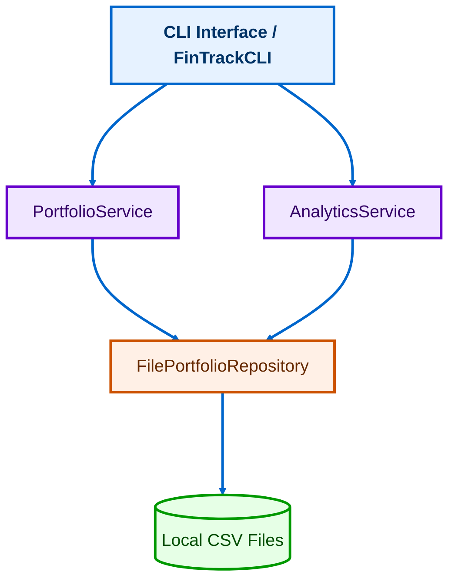

```mermaid
%%{
  init: {
    "theme": "base",
    "themeVariables": {
      "primaryTextColor": "#003366",
      "lineColor": "#0066cc",
      "fontFamily": "arial, sans-serif",
      "fontSize": "20px"
    },
    "flowchart": {
      "nodeSpacing": 100,
      "rankSpacing": 120,
      "curve": "basis",
      "htmlLabels": true
    }
  }
}%%
graph TD
    classDef ui fill:#e6f2ff,stroke:#0066cc,stroke-width:3px,color:#003366,font-weight:bold;
    classDef service fill:#f0e6ff,stroke:#6600cc,stroke-width:3px,color:#330066;
    classDef repo fill:#fff0e6,stroke:#cc5200,stroke-width:3px,color:#662900;
    classDef fs fill:#e6ffe6,stroke:#009900,stroke-width:3px,color:#004d00;
    
    linkStyle default stroke:#0066cc,stroke-width:3px;

    UI[CLI Interface / FinTrackCLI]:::ui
    
    Service1[PortfolioService]:::service
    Service3[AnalyticsService]:::service
    
    Repo[FilePortfolioRepository]:::repo
    
    FS[(Local CSV Files)]:::fs
    
    UI --> Service1
    UI --> Service3
    
    Service1 --> Repo
    Service3 --> Repo
    
    Repo --> FS
```
