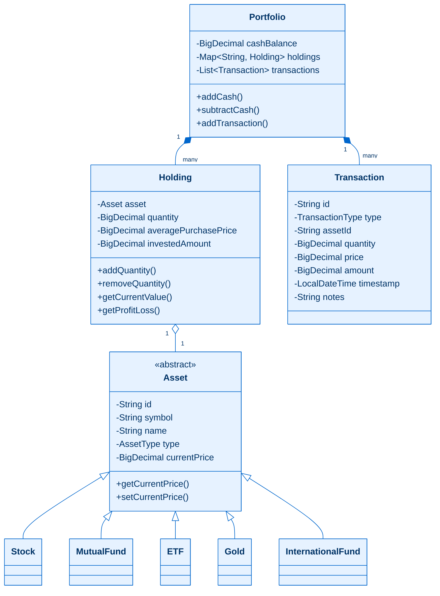

```mermaid
%%{
  init: {
    "theme": "base",
    "themeVariables": {
      "primaryColor": "#e6f2ff",
      "primaryBorderColor": "#0066cc",
      "primaryTextColor": "#003366",
      "lineColor": "#0066cc",
      "fontFamily": "arial, sans-serif",
      "fontSize": "16px",
      "classText": "#003366",
      "nodeBorder": "#0066cc"
    },
    "class": {
      "fontSize": "18px",
      "htmlLabels": true
    }
  }
}%%
classDiagram
    class Asset {
        <<abstract>>
        -String id
        -String symbol
        -String name
        -AssetType type
        -BigDecimal currentPrice
        +getCurrentPrice()
        +setCurrentPrice()
    }
    
    class Stock { }
    class MutualFund { }
    class ETF { }
    class Gold { }
    class InternationalFund { }
    
    Asset <|-- Stock
    Asset <|-- MutualFund
    Asset <|-- ETF
    Asset <|-- Gold
    Asset <|-- InternationalFund
    
    class Holding {
        -Asset asset
        -BigDecimal quantity
        -BigDecimal averagePurchasePrice
        -BigDecimal investedAmount
        +addQuantity()
        +removeQuantity()
        +getCurrentValue()
        +getProfitLoss()
    }
    
    class Transaction {
        -String id
        -TransactionType type
        -String assetId
        -BigDecimal quantity
        -BigDecimal price
        -BigDecimal amount
        -LocalDateTime timestamp
        -String notes
    }
    
    class Portfolio {
        -BigDecimal cashBalance
        -Map~String, Holding~ holdings
        -List~Transaction~ transactions
        +addCash()
        +subtractCash()
        +addTransaction()
    }
    
    Portfolio "1" *-- "many" Holding
    Portfolio "1" *-- "many" Transaction
    Holding "1" o-- "1" Asset
```
