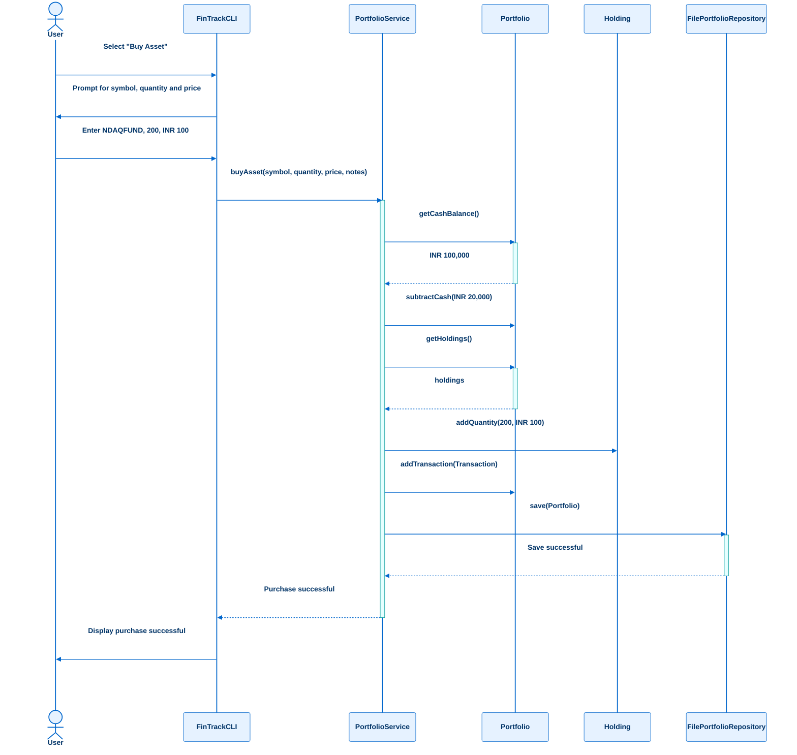

```mermaid
%%{
  init: {
    "theme": "base",
    "themeVariables": {
      "actorBkg": "#e6f2ff",
      "actorBorder": "#0066cc",
      "actorTextColor": "#003366",
      "signalColor": "#0066cc",
      "signalTextColor": "#003366",
      "activationBkgColor": "#e6ffff",
      "activationBorderColor": "#009999",
      "fontFamily": "arial, sans-serif",
      "fontSize": "18px"
    },
    "sequence": {
      "actorFontSize": "22px",
      "actorFontWeight": "bold",
      "messageFontSize": "18px",
      "messageFontWeight": "bold",
      "boxMargin": 60,
      "messageMargin": 60,
      "actorMargin": 80
    }
  }
}%%
sequenceDiagram
    actor User
    participant CLI as FinTrackCLI
    participant PS as PortfolioService
    participant P as Portfolio
    participant H as Holding
    participant Repo as FilePortfolioRepository

    User->>CLI: Select "Buy Asset"
    CLI->>User: Prompt for symbol, quantity and price
    User->>CLI: Enter NDAQFUND, 200, INR 100

    CLI->>PS: buyAsset(symbol, quantity, price, notes)
    activate PS

    PS->>P: getCashBalance()
    activate P
    P-->>PS: INR 100,000
    deactivate P

    PS->>P: subtractCash(INR 20,000)
    
    PS->>P: getHoldings()
    activate P
    P-->>PS: holdings
    deactivate P

    PS->>H: addQuantity(200, INR 100)
    
    PS->>P: addTransaction(Transaction)

    PS->>Repo: save(Portfolio)
    activate Repo
    Repo-->>PS: Save successful
    deactivate Repo

    PS-->>CLI: Purchase successful
    deactivate PS

    CLI->>User: Display purchase successful
```
