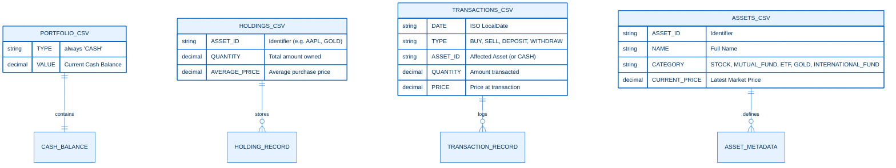

```mermaid
%%{
  init: {
    "theme": "base",
    "themeVariables": {
      "primaryColor": "#e6f2ff",
      "primaryBorderColor": "#0066cc",
      "primaryTextColor": "#003366",
      "lineColor": "#0066cc",
      "fontFamily": "arial, sans-serif",
      "fontSize": "16px"
    },
    "er": {
      "fontSize": "18px"
    }
  }
}%%
erDiagram
    PORTFOLIO_CSV ||--|| CASH_BALANCE : contains
    PORTFOLIO_CSV {
        string TYPE "always 'CASH'"
        decimal VALUE "Current Cash Balance"
    }

    HOLDINGS_CSV ||--o{ HOLDING_RECORD : stores
    HOLDINGS_CSV {
        string ASSET_ID "Identifier (e.g. AAPL, GOLD)"
        decimal QUANTITY "Total amount owned"
        decimal AVERAGE_PRICE "Average purchase price"
    }

    TRANSACTIONS_CSV ||--o{ TRANSACTION_RECORD : logs
    TRANSACTIONS_CSV {
        string DATE "ISO LocalDate"
        string TYPE "BUY, SELL, DEPOSIT, WITHDRAW"
        string ASSET_ID "Affected Asset (or CASH)"
        decimal QUANTITY "Amount transacted"
        decimal PRICE "Price at transaction"
    }

    ASSETS_CSV ||--o{ ASSET_METADATA : defines
    ASSETS_CSV {
        string ASSET_ID "Identifier"
        string NAME "Full Name"
        string CATEGORY "STOCK, MUTUAL_FUND, ETF, GOLD, INTERNATIONAL_FUND"
        decimal CURRENT_PRICE "Latest Market Price"
    }
```
