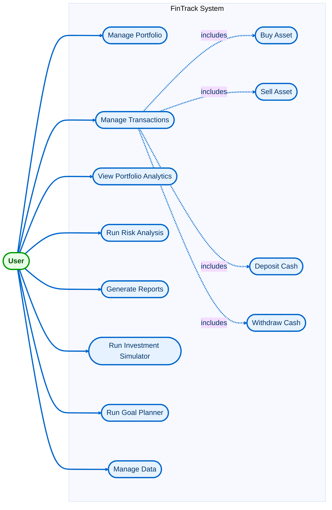

```mermaid
%%{
  init: {
    "theme": "base",
    "themeVariables": {
      "primaryTextColor": "#003366",
      "lineColor": "#0066cc",
      "fontFamily": "arial, sans-serif",
      "fontSize": "18px"
    },
    "flowchart": {
      "nodeSpacing": 100,
      "rankSpacing": 100,
      "curve": "basis",
      "htmlLabels": true
    }
  }
}%%
graph LR
    classDef actor fill:#e6ffe6,stroke:#009900,stroke-width:3px,color:#004d00,font-weight:bold;
    classDef uc fill:#e6f2ff,stroke:#0066cc,stroke-width:3px,color:#003366;

    User([User]):::actor
    
    subgraph FinTrack System
        UC1([Manage Portfolio]):::uc
        UC2([Manage Transactions]):::uc
        UC3([View Portfolio Analytics]):::uc
        UC4([Run Risk Analysis]):::uc
        UC5([Generate Reports]):::uc
        UC6([Run Investment Simulator]):::uc
        UC7([Run Goal Planner]):::uc
        UC8([Manage Data]):::uc
        
        UC2_1([Buy Asset]):::uc
        UC2_2([Sell Asset]):::uc
        UC2_3([Deposit Cash]):::uc
        UC2_4([Withdraw Cash]):::uc
    end
    
    User --> UC1
    User --> UC2
    User --> UC3
    User --> UC4
    User --> UC5
    User --> UC6
    User --> UC7
    User --> UC8
    
    UC2 -.->|includes| UC2_1
    UC2 -.->|includes| UC2_2
    UC2 -.->|includes| UC2_3
    UC2 -.->|includes| UC2_4
    
    linkStyle default stroke:#0066cc,stroke-width:3px;
```
