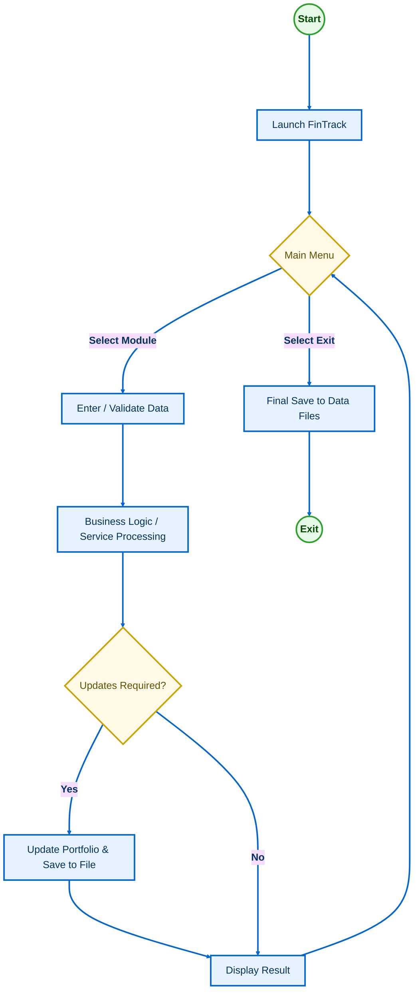

```mermaid
%%{
  init: {
    "theme": "base",
    "themeVariables": {
      "primaryTextColor": "#003366",
      "lineColor": "#0066cc",
      "fontFamily": "arial, sans-serif",
      "fontSize": "20px"
    },
    "flowchart": {
      "nodeSpacing": 120,
      "rankSpacing": 150,
      "curve": "basis",
      "htmlLabels": true
    }
  }
}%%
graph TD
    classDef startend fill:#e6f9e6,stroke:#2ca02c,stroke-width:3px,color:#004d00,font-weight:bold;
    classDef process fill:#e6f2ff,stroke:#0066cc,stroke-width:3px,color:#003366;
    classDef decision fill:#fff9e6,stroke:#cca300,stroke-width:3px,color:#665200;
    
    linkStyle default stroke:#0066cc,stroke-width:3px,color:#003366,font-weight:bold;

    Start((Start)):::startend --> Launch[Launch FinTrack]:::process
    Launch --> MainMenu{Main Menu}:::decision
    
    MainMenu -- Select Module --> InputData[Enter / Validate Data]:::process
    InputData --> ProcessLogic[Business Logic / Service Processing]:::process
    
    ProcessLogic --> UpdateData{Updates Required?}:::decision
    
    UpdateData -- Yes --> SaveRepo[Update Portfolio & Save to File]:::process
    SaveRepo --> DisplayResult[Display Result]:::process
    
    UpdateData -- No --> DisplayResult
    
    DisplayResult --> MainMenu
    
    MainMenu -- Select Exit --> SaveFinal[Final Save to Data Files]:::process
    SaveFinal --> Exit((Exit)):::startend
```
